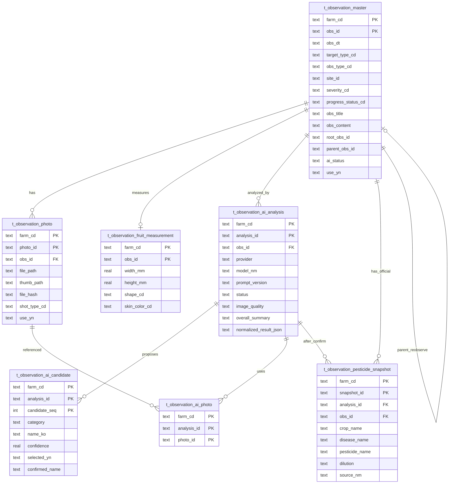

# 모바일 관찰일지 설계 (Step-09)

> 조사 기준일: 2026-07-16  
> 범위: **조사·설계만** (기능/DB/API/사진 저장 구현 없음)  
> 원천: PyQt 관찰일지 Stage1~3 + SQLite (`ensure_observation_*` 스키마)

본 문서는 **초기 설계 문서**이다.

**Project A에서는 Orchard Design System(ODS) v1.0을 최우선 기준으로 한다.**  
공식 ODS: `mobile/docs/ODS/ODS_v1.0.pdf` · 최상위: `mobile/PROJECT_MASTER.md`

사진 정책은 다음을 따른다.

- **관찰 저장:** 최대 5장
- **AI 분석:** 동시 최대 3장

---

## 1. 현재 구조

### 1.1 개요

데스크톱 관찰일지는 **3단계**로 구성된다.

| Stage | 내용 | 핵심 모듈 |
|-------|------|-----------|
| 1 | 관찰 본문 CRUD, 공통코드, 계보(`root`/`parent`) | `core/db_manager.py`, `ui/pages/observation_log_page.py` |
| 2 | 사진·썸네일·열매측정·추적 비교 | `core/observation_stage2.py`, `core/observation_media.py`, `ui/widgets/observation/photo_*` |
| 3 | AI Vision 분석·후보 확정·PSIS 농약 스냅샷 | `core/observation_stage3.py`, `core/ai/*`, `core/pesticide/*`, `ui/widgets/observation/ai_*` |

모바일(`mobile/src/views/ObservationView.vue`)은 현재 **플레이스홀더**만 존재한다.

### 1.2 관련 파일

#### UI (PyQt)
- `ui/pages/observation_log_page.py` — 목록·편집 다이얼로그
- `ui/widgets/observation/photo_panel.py` — 사진 탭
- `ui/widgets/observation/photo_import_worker.py` — 사진 가져오기 워커
- `ui/widgets/observation/photo_compare_dialog.py` — 추적 사진 비교
- `ui/widgets/observation/ai_analysis_panel.py` — AI·확정·PSIS UI
- `ui/widgets/observation/ai_analysis_worker.py` — AI QThread
- `ui/widgets/observation/psis_search_worker.py` — PSIS 조회 워커
- `ui/widgets/observation/fruit_growth_chart.py` — 열매 생육 차트
- `app/main_app.py` — 메뉴 `MN16`

#### Core / AI / 농약
- `core/db_manager.py` — Stage1 스키마·CRUD, Stage2/3 위임
- `core/observation_stage2.py` — 사진·열매측정
- `core/observation_stage3.py` — AI·후보·PSIS 스냅샷
- `core/observation_media.py` — 파일 저장소 (**BLOB 금지**)
- `core/observation_safe_errors.py` — 사용자용 안전 오류 문구
- `core/ai/observation_ai_provider.py` — Provider 인터페이스
- `core/ai/observation_ai_schema.py` — JSON 스키마·프롬프트 (`obs_ai_v1`)
- `core/ai/observation_ai_service.py` — 분석 오케스트레이션
- `core/ai/openai_observation_provider.py` — OpenAI Responses API + Vision
- `core/ai/image_sanitize.py` — EXIF 제거·축소·data URL
- `core/pesticide/pesticide_service.py` — `ObservationPesticideService`
- `core/pesticide/psis_provider.py` — PSIS OpenAPI
- `core/orchard_env.py` — `.orchard.env` 키 로딩

#### 테스트·문서·모바일
- `tests/test_observation_stage3.py`
- `server/docs/sqlite_schema_baseline.md`
- `mobile/src/views/ObservationView.vue` — 미구현 안내만

#### 관찰과 미연결 (혼동 주의)
- `core/pesticide_ai_recommend_manager.py`, `t_pest_ai_recommend_log` — **방제 AI 추천(별도)**. 관찰 `obs_id` 참조 없음.

### 1.3 DB 테이블 (SQLite)

스키마 진실원천은 `dbscript` DDL이 아니라 **런타임 멱등** `ensure_observation_schema()` 이다.

| 테이블 | 역할 |
|--------|------|
| `t_observation_master` | 관찰 본문. PK `(farm_cd, obs_id)` |
| `t_observation_photo` | 사진 메타·상대경로. PK `(farm_cd, photo_id)` |
| `t_observation_fruit_measurement` | 열매 측정 1:1. PK `(farm_cd, obs_id)` |
| `t_observation_ai_analysis` | AI 분석 헤더 |
| `t_observation_ai_candidate` | 후보 최대 3 + 확정 |
| `t_observation_ai_photo` | 분석에 사용한 사진 연결 |
| `t_observation_pesticide_snapshot` | PSIS 공식 등록정보 스냅샷 |

채번:
- 관찰: `OBS{YYYYMMDD}-{SEQ:03d}`
- 사진: `PHO{YYYYMMDD}-{SEQ:03d}`

공통코드 상위:
- `OB01` 대상, `OY01` 유형, `OS01` 심각도, `OP01` 처리상태, `OA01` AI상태
- `OH01` 촬영유형, `FS01`/`FC01`/`FK01`/`FY01` 열매 관련

### 1.4 사진 저장 방식

| 항목 | 현재 |
|------|------|
| 방식 | **로컬 파일 + DB 상대경로** (BLOB 없음) |
| 루트(Win) | `%LOCALAPPDATA%\OrchardPlatform\observation_photos` |
| 상대경로 | `{farm_cd}/{YYYY}/{obs_id}/original/{photo_id}.{ext}` |
| 썸네일 | `{farm_cd}/{YYYY}/{obs_id}/thumbnail/{photo_id}.{ext}` (긴 변 400px) |
| 제한 | 최대 20MB, `.jpg/.jpeg/.png/.webp` |
| 중복 | `file_hash`(SHA-256) |
| 삭제 | DB `use_yn='N'` soft delete (물리 파일은 기본적으로 잔존) |
| 촬영 | 카메라 API 없음. `QFileDialog` 파일 선택만 |

### 1.5 AI 분석 입력·출력 / Vision

**Vision 사용: 예** (OpenAI Responses API `input_image` + data URL)

입력 흐름:
1. UI에서 사진 1~3장 선택
2. `prepare_images_for_ai`: EXIF 제거, 긴 변 ≤1600px JPEG, base64 data URL
3. API에는 **이미지 data URL + 선택적 `crop_hint`**만 전달 (경로·farm_cd 미포함)

출력(정규화 JSON / DB):
- `analysis_possible`, `image_quality`, `overall_summary`, `target_part`
- `candidates[]` (category, name_ko, scientific_name, confidence, visual_evidence, differential_reason, urgency)
- `additional_photos`, `safe_immediate_actions`, `warning`
- 테이블: `t_observation_ai_analysis` + `t_observation_ai_candidate` + `t_observation_ai_photo`
- 마스터 `ai_status`: `NONE` → `ANALYZING` → `ANALYZED` / `REVIEW_REQUIRED` / `FAILED` / `CONFIRMED`

프롬프트 원칙: **약제명·희석·살포 금지**, 후보(가능성)만 허용 (`PROMPT_VERSION=obs_ai_v1`).

환경변수: `OPENAI_API_KEY`, `ORCHARD_OPENAI_MODEL`(기본 gpt-5.6), `ORCHARD_AI_TIMEOUT_SEC`

### 1.6 OpenAI 호출 흐름

```text
[PC]
AiAnalysisPanel._on_analyze
  → ObservationAiWorker (QThread · Signal)
    → ObservationAiApplicationService.run_analysis
      → ObservationAiService.analyze_photo_paths
        → prepare_images_for_ai (image_sanitize)
        → OpenAIObservationProvider.analyze
             └─ client.responses.create (Vision + JSON Schema)
      → save_ai_analysis_result / update_observation_ai_status

[Mobile / REST — 동일 ApplicationService]
POST /api/v1/farms/{farm_cd}/observations/{obs_id}/analysis
  → ObservationAiApiService (사진 확인·DTO만)
    → ObservationAiApplicationService.run_analysis
      → (이하 PC와 동일)
      → 동일 obs ANALYZING 중이면 AI_BUSY (Provider 미호출)

GET  .../analysis          → Stage3 get_latest_ai_analysis
GET  .../analysis/history  → Stage3 list_ai_analysis_history

[PC PSIS]
AiAnalysisPanel → PsisSearchWorker
  → ObservationPsisApplicationService.run_search
    → ObservationPesticideService.search_with_cache_policy
    → replace_pesticide_snapshots

[Mobile / REST PSIS — 동일 ApplicationService]
POST /api/v1/farms/{farm_cd}/observations/{obs_id}/psis
GET  .../psis
GET  .../psis/history
```

PSIS REST는 ApplicationService만 호출하며, 검색 알고리즘·스냅샷 의미는 PC와 동일하다.

### 1.7 AI 추천(농약) 연결

관찰 내 농약 정보는 **GPT가 추천하지 않는다.**

```text
AI 후보 확정(confirm_ai_candidate)
  → 작물명 선택 + “공식 등록정보 조회”
  → PsisSearchWorker → ObservationPesticideService (PSIS OpenAPI)
  → t_observation_pesticide_snapshot (캐시 정책 포함)
```

방제 AI 추천(`pesticide_ai_recommend_*`)과는 **코드·DB 미연결**.

### 1.8 현재 저장 항목 요약

**마스터:** `obs_dt`, `target_type_cd`, `obs_type_cd`, `site_id`, `severity_cd`, `progress_status_cd`, `obs_title`, `obs_content`, (선택) 구역·나무번호·조치·후속일, `root_obs_id`/`parent_obs_id`, `ai_status`

**사진:** 메타 + `file_path`/`thumb_path`

**열매(대상=열매일 때):** 수치·형태·과피색·결점 YN 등

**AI/PSIS:** 분석·후보·사용사진·농약 스냅샷

---

## 2. 문제점

1. **모바일 미구현** — API·동기화·업로드 레이어 없음.
2. **PC 로컬 파일 의존** — 사진은 노트북 `%LOCALAPPDATA%`에만 존재. 폰·서버와 공유 불가.
3. **PyQt 이미지 처리** — `QImage` 기반 sanitize/thumbnail. 서버·모바일은 재구현 필요.
4. **카메라 없음** — 현장 촬영 UX가 데스크톱에 없음.
5. **Soft delete 고아 파일** — 디스크 잔존·용량 관리 정책 부재.
6. **API 키 클라이언트 보유 위험** — OpenAI/PSIS 키를 모바일 앱에 넣으면 유출. **서버 프록시 필수**.
7. **AI 상태 이중성** — 공통코드 `OA01*`와 DB 문자열(`NONE`/`ANALYZING` 등) 혼재.
8. **스키마가 코드에만 존재** — PostgreSQL 이전 시 `ensure_*`를 마이그레이션 소스로 복제해야 함.
9. **같은 Wi-Fi 개발 전제** — 현장 실사용 시 업로드·오프라인 큐 필수.
10. **방제 AI와 명칭 혼동** — 제품/기획 문서에서 분리 표기 필요.

---

## 3. 모바일 추천 구조

### 3.1 원칙

- **데스크톱 도메인 모델 유지**: 관찰 → 사진 → AI분석 → 후보확정 → PSIS 스냅샷
- **쓰기·AI·키는 FastAPI 서버** (모바일은 UI + 업로드만)
- **SQLite는 당분간 읽기/쓰기 원천**, 이후 PostgreSQL로 이전
- GPT는 **병해충 후보만**, 약은 **PSIS만**

### 3.2 화면 구성 (권장)

| 화면 | 역할 | 우선순위 |
|------|------|----------|
| 관찰 목록 | 날짜·필지·AI상태 필터 | P0 |
| 관찰 상세 | 본문·사진 썸네일·AI 요약 | P0 |
| 관찰 작성/수정 | 필수 필드 + 사진 첨부(1~3) | P0 |
| AI 결과 | 후보 선택·확정 | P1 |
| PSIS 결과 | 공식 등록정보 표시(읽기) | P1 |
| 열매 측정 | 대상=열매일 때 | P2 |
| 추적/재관찰 | `parent`/`root` 계보 | P2 |

### 3.3 API 계층 (향후, 이번 Step 미구현)

권장 prefix: `/api/v1/farms/{farm_cd}/observations...`

- 목록/상세/생성/수정 (마스터)
- 사진 업로드(multipart) → 서버가 파일 저장 + 메타 INSERT
- AI 분석 요청(서버가 키·sanitize·OpenAI 호출)
- 후보 확정 / PSIS 조회

모바일은 **OpenAI·PSIS 키를 절대 보유하지 않는다.**

### 3.4 데이터 흐름 (모바일)

```text
[휴대폰] 촬영/갤러리
  → multipart 업로드 → [FastAPI]
      → 미디어 스토리지 + t_observation_photo
  → (선택) AI 분석 API → OpenAI Vision → DB 저장
  → 후보 확정 → PSIS → snapshot
  → [휴대폰] 결과 표시
```

---

## 4. 사진 저장 전략

| 단계 | 전략 |
|------|------|
| 단기(모바일 MVP) | 서버(또는 NAS) 디스크에 기존과 동일 **상대경로 규칙** 유지. DB에는 path만. |
| 중기 | `observation_photos` 루트를 서버 공유 볼륨으로 이전. PC PyQt도 동일 루트(설정)로 읽기. |
| 장기 | 객체 스토리지(S3 호환) + signed URL. DB에 `object_key`/`content_type`/`file_hash`. |

권장 규칙(현행 유지):
- `{farm_cd}/{YYYY}/{obs_id}/original|thumbnail/{photo_id}.{ext}`
- 업로드 시 서버에서 썸네일 생성·해시·용량 검증
- soft delete + 주기적 GC 잡(물리 삭제) 도입
- 관찰당 AI용 사진 **최대 3장** 유지

BLOB를 DB에 넣는 방식은 **비권장**(현행 설계와 충돌, 백업·동기화 비용).

---

## 5. AI 분석 전략

1. **서버 전용 호출** — `ObservationAiService` 로직을 FastAPI 서비스로 이식.
2. **동일 스키마** — `obs_ai_v1` JSON Schema·프롬프트 유지(약제 추천 금지).
3. **동의 UX** — 외부 전송 전 고지(이미지 업로드·AI 분석).
4. **상태 머신** — `NONE → ANALYZING → ANALYZED|FAILED|REVIEW_REQUIRED → CONFIRMED` 문서화·코드 상수 단일화.
5. **재분석** — 신규 `analysis_id` 추가, 기존 `CONFIRMED` 보존(현행 `save_ai_analysis_result` 정책 유지).
6. **오류** — `observation_safe_errors` 수준의 사용자 문구만 노출.
7. **비용/한도** — 관찰당 분석 횟수·동시성 제한(서버).

---

## 6. 오프라인 전략

| 레벨 | 내용 |
|------|------|
| L0 (현재 개발) | 온라인 필수. 같은 Wi-Fi + FastAPI. |
| L1 | 작성 폼 초안을 기기 IndexedDB/localStorage에 임시 저장. 온라인 시 업로드. |
| L2 | 사진 큐(실패 재시도), 충돌 시 서버 `mod_dt` 우선 또는 사용자 선택. |
| L3 | PWA 정적 셸 캐시(이미 Step-08). **API·사진 응답은 캐시하지 않음.** |

현장 권장 최소: **L1(초안) + 사진 업로드 재시도**. AI/PSIS는 온라인 전용.

---

## 7. 향후 PostgreSQL 구조

- 테이블·PK·관계는 SQLite와 **동일 논리 모델**로 이전.
- `farm_cd` 복합키 유지 또는 `obs_id` 전역 UNIQUE + `farm_cd` 인덱스로 완화(이전 시 결정).
- JSON 컬럼(`normalized_result_json` 등)은 `JSONB`.
- 파일은 DB 밖 스토리지, PG에는 메타만.
- 마이그레이션 소스: `ensure_observation_*` DDL을 Alembic/SQL로 문서화.
- 읽기 API는 이미 SQLite inspect 기반이므로, 쓰기·미디어·AI는 PG 전환 전에도 **서버 디스크 + SQLite**로 시작 가능.

---

## 8. ERD (Mermaid)



관계 요약:

```text
관찰일지 (master)
  ↓ 1:N
사진 (photo, 파일경로)
  ↓ N:M (via ai_photo)
AI분석 (analysis)
  ↓ 1:N
후보 (candidate) → 사용자 확정
  ↓
PSIS 스냅샷 (공식 등록정보 추천·조회 결과)
```

---

## 9. 모바일 구현 순서 (권장)

| Step | 내용 | 비고 |
|------|------|------|
| 10 | 관찰 **읽기 API** (목록/상세/사진 메타·썸네일 URL) | 쓰기 없음 |
| 11 | 모바일 목록·상세 UI | 카메라/저장 없음 |
| 12 | 관찰 **작성 API** + 사진 업로드(서버 스토리지) | 키는 서버 |
| 13 | 모바일 작성·갤러리/카메라 첨부 | AI 없음 |
| 14 | AI 분석 API(서버 프록시) + 후보 확정 UI | Vision |
| 15 | PSIS 조회 API + 스냅샷 표시 | 약제 공식정보 |
| 16 | 오프라인 초안·업로드 큐 | L1~L2 |
| 17 | PostgreSQL 이전·객체 스토리지 | 장기 |

---

## 10. 이번 Step 범위 확인

| 항목 | 수행 |
|------|------|
| 조사·문서 | ✅ `docs/mobile_observation_design.md` |
| 기능 추가 | ❌ |
| DB 수정 | ❌ |
| API 추가 | ❌ |
| 사진 저장 | ❌ |
| PyQt 수정 | ❌ |
| Git commit | ❌ |
